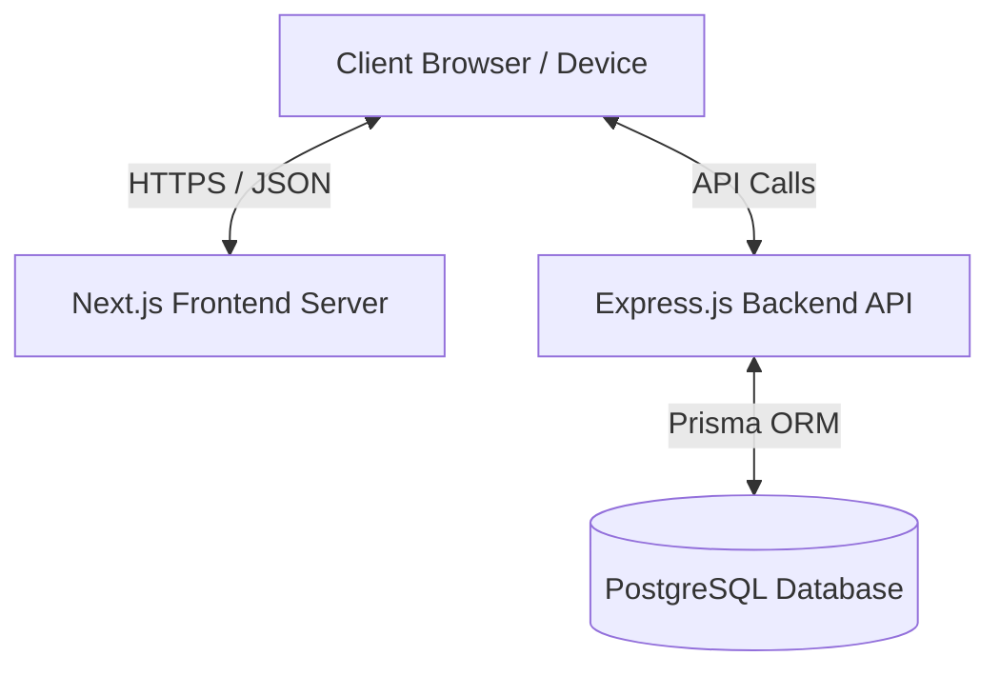
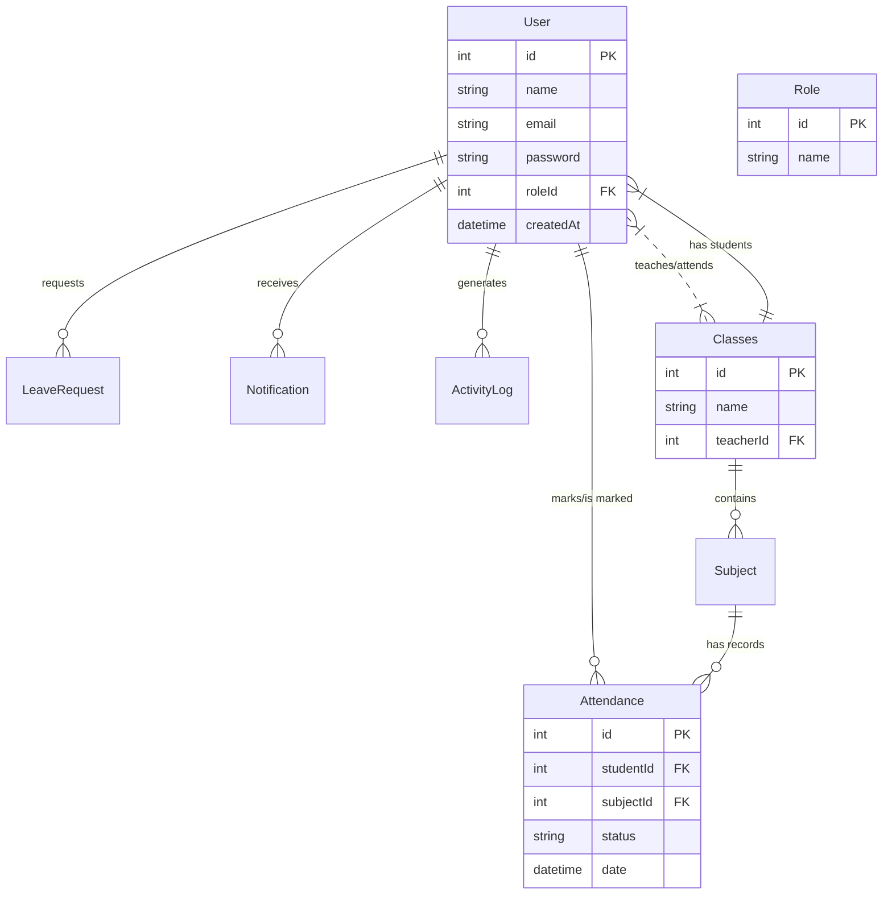

# PROJECT REPORT

## Attenda - Attendance Management System

---

## TABLE OF CONTENTS

- **ABSTRACT**
- **LIST OF FIGURES**
- **1. INTRODUCTION**
  - 1.1 Attendance Management System - Overview
  - 1.2 Problem Statement
  - 1.3 Project Objectives
  - 1.4 Methodology and Workflow
- **2. TECHNOLOGY STACK**
  - 2.1 Hardware Requirements
  - 2.2 Software Requirements
  - 2.3 Development Tools & Frameworks
  - 2.4 Software Development Life Cycle (SDLC)
- **3. SYSTEM DESIGN**
  - 3.1 Database
  - 3.2 ER Diagram
- **4. SYSTEM IMPLEMENTATION**
  - 4.1 Login Module
  - 4.2 Admin Dashboard
  - 4.3 Teacher Dashboard
  - 4.4 Student Dashboard
  - 4.5 Student Management
  - 4.6 Teacher Management
  - 4.7 Class & Subject Management
  - 4.8 Take Attendance
  - 4.9 Logout Module
- **5. RESULTS & ANALYSIS**
  - 5.1 User Interface
  - 5.2 Backend Functionality & API Handling
  - 5.3 Performance Testing & Optimization
- **6. CONCLUSION**
  - 6.1 Summary of Achievements
  - 6.2 Future Scope

---

## ABSTRACT

Attenda is a comprehensive web-based attendance management system designed to digitize and optimize attendance tracking for educational institutions. The system offers a seamless interface for administrators, teachers, and students, allowing efficient monitoring and management of attendance records. With dedicated dashboards for each user role, the platform facilitates secure login, real-time attendance marking, and automated report generation. The role-based access control ensures data integrity and privacy, while the system’s responsive and intuitive design enhances user experience across devices. By replacing traditional manual methods with a centralized digital solution, Attenda reduces administrative workload, minimizes errors, and fosters a more transparent and efficient attendance process.

---

## LIST OF FIGURES

- Figure 3.1: Entity Relationship (ER) Diagram
- Figure 3.2: System Architecture

---

## 1. INTRODUCTION

Managing attendance is crucial in educational institutions but is often handled manually, leading to errors, inefficiencies, and time loss. Attenda is a digital attendance management system designed to simplify this process by offering a centralized, user-friendly, and real-time solution for students, teachers, and administrators. This chapter introduces the system, the problems it solves, its objectives, and the development approach.

### 1.1 Attendance Management System – Overview

An Attendance Management System automates the process of recording and monitoring attendance. Attenda offers dedicated dashboards for different user roles, enabling seamless attendance tracking, report generation, and system access. It replaces manual registers with a digital interface that ensures accuracy, saves time, and improves institutional workflow.

### 1.2 Problem Statement

Manual attendance systems are time-consuming, error-prone, and lack transparency. Teachers waste class time marking attendance, reports are hard to compile, and students can't track their own records. There's a clear need for a digital system that is efficient, secure, and real-time—Attenda addresses this gap.

### 1.3 Project Objectives

- Digitize attendance processes.
- Provide real-time tracking and reporting.
- Offer role-based dashboards.
- Enhance data security and privacy.
- Reduce administrative workload.

### 1.4 Methodology and Workflow

The development of Attenda follows a structured methodology grounded in modern web development practices. The process began with requirement analysis through consultation with potential users, including students, teachers, and administrators, to understand their challenges and expectations. A modular and scalable architecture was then designed to ensure separation of concerns and ease of maintenance.

The frontend and backend were developed concurrently, with a clear focus on responsive design and secure API integration. Authentication and role-based access control were implemented early to safeguard sensitive data. Each user interface—admin, teacher, and student—was designed with usability in mind. Features such as attendance marking, data visualization, and reporting tools were iteratively developed and tested.

Throughout the workflow, Agile principles were followed, allowing for iterative improvements based on feedback. Testing was performed at each stage to ensure functionality, performance, and security. The final deployment involved connecting the system to a production-ready database and hosting the platform in a scalable environment, ensuring accessibility and reliability for end users.

---

## 2. TECHNOLOGY STACK

The technology stack used in the development of the Attenda Website is carefully chosen to ensure performance, scalability, and maintainability. The stack is divided into hardware, software, development tools, and frameworks. These technologies work together to deliver a seamless experience for users including administrators, teachers, and students.

The frontend is built using **Next.js** and **Tailwind CSS**, enabling a fast, responsive, and mobile-friendly user interface. The backend is powered by **Node.js**, **Express**, and **Prisma**, which handles business logic, authentication, and RESTful APIs for smooth communication between client and server.

A relational database like **PostgreSQL** is used to store structured data such as students, classes, subjects, and attendance records. JWT-based authentication ensures secure user access across all platforms. This robust stack ensures the application runs efficiently on both local and cloud environments, supporting both web and mobile deployments.

### 2.1 Hardware Requirements

- **Processor**: Intel Core i5 or above
- **RAM**: 8 GB or more
- **Hard Disk**: 256 GB SSD (recommended)
- **Display**: Minimum 1366x768 resolution
- **Internet**: Required for hosting and remote access

### 2.2 Software Requirements

- **Operating System**: Windows 10 and Windows 11
- **Web Browser**: Chrome, Firefox, Edge
- **Backend**: Node.js, Express, and Prisma
- **Frontend**: Next.js and Tailwind CSS
- **Database**: PostgreSQL (for development)

### 2.3 Development Tools & Frameworks

- **Code Editor**: Visual Studio Code
- **Version Control**: Git
- **API Testing**: Postman
- **Package Managers**: npm (frontend), npm, npx (backend)

### 2.4 Software Development Life Cycle (SDLC)

The Iterative Waterfall Model is a modified version of the traditional Waterfall Software Development Life Cycle (SDLC). In this model, development is carried out in sequential phases such as Requirement Analysis, Design, Implementation, Testing, Deployment, and Maintenance.

**Phases in Attenda's Development:**

1.  **Requirement Analysis**: Gathered inputs from students, teachers, and admins to define clear system needs.
2.  **System Design**: Created database schemas, UI wireframes, and flow diagrams with role-based access control in mind.
3.  **Implementation**: Developed modular code for both frontend and backend, focusing on responsiveness and API integration.
4.  **Testing**: Conducted functional and user testing. Based on feedback, earlier stages like UI design and logic were revised.
5.  **Deployment**: Deployed the app on a live server with production-ready settings.
6.  **Maintenance**: Ongoing updates and issue resolution based on real-world usage and user feedback.

---

## 3. SYSTEM DESIGN

The system design of the Attenda website follows a modular, component-based architecture that ensures scalability, maintainability, and high performance. Each layer of the application is decoupled and communicates efficiently through RESTful APIs, maintaining a clean separation of concerns.

### Architecture Overview

The application adopts a Full Stack Web Architecture composed of the following technologies:

- **Frontend**: Built with Next.js, which provides seamless navigation, server-side rendering (SSR), and enhanced SEO performance. The UI components are styled using Tailwind CSS, offering a responsive and elegant design with minimal custom CSS.
- **Backend**: Powered by Node.js and Express.js, the backend handles business logic, user authentication, and API routing. It serves as the core of server-side operations.
- **Database Layer**: Uses Prisma ORM to interact with a PostgreSQL database. Prisma simplifies database queries and provides type safety, improving productivity and code reliability.
- **API Communication**: RESTful APIs enable smooth data flow between the frontend, backend, and database layers, ensuring consistent data handling and integration.

This modular architecture allows each part of the application to be developed, tested, and maintained independently, ensuring a robust and efficient attendance management system.

_Figure 3.2: System Architecture_

### 3.1 Database

The database used in the Attenda Website is **PostgreSQL**, a powerful, open-source object-relational database system known for its reliability, performance, and advanced features. The data is structured in normalized tables to maintain data integrity and avoid redundancy.
We're using **Prisma ORM** to interact with the database, which makes schema modeling, migrations, and queries super easy and clean. Prisma provides a type-safe and modern way to handle complex relationships between tables.

**Main Tables:**

- **User**: stores all users: admin, teacher, student
- **Role**: defines user roles: admin, teacher, student
- **Class**: represents school or college classes
- **Subject**: each subject is linked to a class and taught by a teacher
- **StudentProfile**: extends user data with student-specific information
- **TeacherProfile**: extends user data with teacher specific information
- **Attendance**: records presence, absence or late of each student per subject per date

**Relationships:**

- One user can have one role
- A class has many students
- A subject is taught by one teacher
- A class can have multiple subjects
- Each attendance record links to one student, one subject, and one date

This data structure ensures secure, scalable and clean data management.

### 3.2 ER Diagram

_Figure 3.1: Entity Relationship (ER) Diagram_

---

## 4. SYSTEM IMPLEMENTATION

The implementation of the Attenda website involved the development of several core modules that collectively deliver a complete attendance management system. Using a full-stack development approach, the system was built to ensure optimal performance, scalability, and security across all layers.

- **Frontend**: The user interface is developed using Next.js, enabling both static and server-side rendering for better performance and smooth navigation. Tailwind CSS is used to style the components, ensuring a responsive, accessible, and visually clean design across all devices.
- **Backend**: The backend is built with Node.js and Express.js, responsible for handling HTTP requests, user authentication, attendance logic, and role-based access. The application exposes RESTful APIs for communication between frontend and backend.
- **Database**: Data persistence is managed using PostgreSQL, a robust and reliable relational database. All interactions with the database are handled through Prisma ORM, which ensures safe, efficient, and structured data operations.

### 4.1 Login Module

Attenda implements a JWT-based login system to ensure secure and stateless user authentication. When a user logs in, a JSON Web Token (JWT) is generated and securely stored on the client side. This token is then used to validate requests and maintain session integrity without the need for continuous re-authentication.

During the registration process, users are assigned specific roles—admin, teacher, or student—which determine their access level within the system. To maintain data privacy and functionality separation, Role-Based Access Control (RBAC) is implemented. Based on the assigned role:

- **Admins** gain access to global reports, user management, and system configuration.
- **Teachers** can view class lists, mark attendance, and monitor student records.
- **Students** are provided with their personal attendance dashboard and status.

### 4.2 Admin Dashboard

The Admin Dashboard provides complete control over the system. Key features include:

- **User Management**: Add, edit, or delete teacher and student accounts.
- **Class & Subject Allocation**: Create and assign classes and subjects to teachers.
- **Attendance Reports**: View complete attendance data for all students and classes.
- **Analytics Overview**: Visual stats like total students, active teachers, and attendance trends are displayed for data-driven decisions.

### 4.3 Teacher Dashboard

The Teacher Dashboard is designed for managing class-specific tasks. Features include:

- **View Assignments**: Teachers can view the classes and subjects assigned to them.
- **Mark Attendance**: Teachers can record daily attendance for their respective classes.
- **Review Records**: Past attendance records can be accessed for auditing or corrections.

### 4.4 Student Dashboard

The Student Dashboard offers a personalized experience for students. It allows:

- **Attendance View**: Students can check their attendance history.
- **Class/Subject Access**: See which classes and subjects they are enrolled in.
- **Status Updates**: Get real-time attendance status and notifications.

### 4.5 Student Management

Admins can manage student information through:

- **CRUD Operations**: Add, edit, or delete student records.
- **Class Assignment**: Assign students to specific classes.
- **Data Export**: Export student data in structured formats for record-keeping or analysis.

### 4.6 Teacher Management

This module allows admins to efficiently manage teacher information:

- **Account Handling**: Register new teachers or update existing profiles.
- **Role Assignment**: Assign classes and subjects to each teacher.

### 4.7 Class & Subject Management

Admins can manage the academic structure through:

- **Class Creation**: Add or remove class sections.
- **Subject Management**: Create subjects and link them with specific classes.
- **Teacher Allocation**: Assign responsible teachers to each subject-class pair.

### 4.8 Take Attendance

This is the core functional module for teachers:

- **Selection Interface**: Teachers select their assigned class and subject.
- **Marking Attendance**: Each student is marked present or absent.
- **Data Storage**: Records are saved with a timestamp, student ID, subject ID, and status.
- **Real-Time Sync**: Supports immediate updates and historical tracking.

### 4.9 Logout Module

The logout mechanism ensures secure session management:

- **Session Destruction**: JWT tokens are invalidated upon logout.
- **Redirection**: Users are securely redirected to the login screen, preventing unauthorized access.

---

## 5. RESULTS & ANALYSIS

The Attenda website was successfully developed as a full-stack attendance management system tailored for educational institutions. The project focused on implementing modern web development practices, delivering a clean and responsive user interface, and ensuring a secure and reliable backend infrastructure. Each module of the application—from authentication to role-based dashboards and attendance tracking—was designed with scalability, usability, and performance in mind.

Comprehensive testing was conducted at every stage to validate accuracy, stability, and a smooth user experience. The final product enables real-time attendance monitoring, simplifies administrative tasks, and enhances communication between students, teachers, and administrators. With its modular architecture and RESTful API integration, Attenda serves as a robust and future-ready solution for digitizing attendance workflows.

### 5.1 User Interface

The user interface was developed using Next.js and styled with Tailwind CSS, resulting in a fast, responsive, and modern web experience across devices.

- Clean and minimal design for all dashboards (Admin, Teacher, Student).
- Fully responsive across mobile, tablet, and desktop screens.
- Consistent use of components like buttons, forms, modals, and tables.
- Role-based navigation ensures users only see the features relevant to them.
- Smooth transitions and routing using Next.js’s built-in features.

### 5.2 Backend Functionality & API Handling

The backend was implemented using Node.js and Express.js, with Prisma handling all communication with the PostgreSQL database. The backend structure is clean, modular, and secure.

- RESTful APIs for authentication, student management, attendance tracking, etc.
- JWT-based user authentication with middleware to protect sensitive routes.
- Prisma used for type-safe and efficient querying with relational joins.
- Custom error handling for all API endpoints.
- Clean separation of concerns with routes, controllers, services, and middleware.

### 5.3 Performance Testing & Optimization

The system was tested for responsiveness, API speed, and data load handling to ensure it performs well under various conditions.

**Performance Testing:**

- **API Response Time**: Most endpoints respond in less than 300ms.
- **Page Load Time**: Next.js SSR and static optimization ensures pages load in under 2 seconds.
- **Database Queries**: Optimized using Prisma’s eager loading and indexing.
- **Scalability**: Designed to support 1000+ students and multiple classes without lag.
- **Load Testing**: Simulated user traffic using Postman & Artillery to validate system stability.

**Optimization Techniques:**

- Used `useMemo` and `useCallback` in React to avoid unnecessary renders.
- API responses cached where possible for repeated queries.
- Prisma’s `.include` and `.select` used to reduce over-fetching of data.
- Backend modularized for better performance and easier scaling.

---

## 6. CONCLUSION

The Attenda Website was successfully designed and implemented as a modern, role-based attendance management system tailored for educational institutions. With the integration of modern tools and technologies like Next.js, Node.js, Express, Prisma and PostgreSQL, the system provides a secure, fast, and user-friendly experience for admins, teachers, and students. From responsive UI to real-time attendance tracking and structured database architecture, every feature was thoughtfully planned and carefully executed.

### 6.1 Summary of Achievements

- Built a full-stack, scalable attendance management platform.
- Designed three unique dashboards: Admin, Teacher, and Student.
- Implemented secure JWT-based authentication.
- Developed a powerful backend with clean RESTful APIs.
- Structured database with Prisma ORM and PostgreSQL.
- Designed beautiful, responsive UI using Tailwind CSS.
- Ensured performance with optimization techniques and testing.
- Delivered a system ready for real-world deployment.

### 6.2 Future Scope

The current implementation of the Attenda Website provides a solid foundation for managing attendance efficiently. However, there are several potential enhancements that can be incorporated in the future to improve functionality, user experience, and scalability.

- **Facial Recognition Integration**: Implementing AI-based facial recognition can automate attendance marking, increasing accuracy and reducing manual effort.
- **Mobile Application Deployment**: Developing native or hybrid mobile applications for Android and iOS platforms can improve accessibility for teachers and students.
- **Push Notification System**: Integrating real-time notifications for absences, upcoming classes, or announcements can enhance communication between users.
- **Advanced Reporting and Analytics**: Providing graphical reports and attendance trends can help institutions identify patterns and improve student engagement.
- **Multi-Language Support**: Adding support for regional languages will make the system more inclusive and user-friendly for non-English speakers.
- **Cloud Hosting and Auto-Backup**: Migrating to cloud platforms can ensure better availability, scalability, and regular data backups.
- **Timetable and Exam Management**: Expanding the system to include features such as class schedules and examination management can turn it into a complete academic management solution.
- **Role-Based Notifications and Messaging**: Implementing an internal messaging or announcement system categorized by user roles can facilitate better communication within the platform.

These enhancements can significantly increase the system's impact and usability, making it a comprehensive tool for academic institutions.
